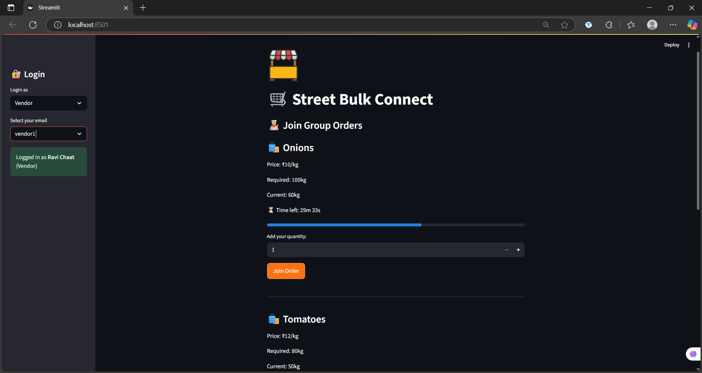
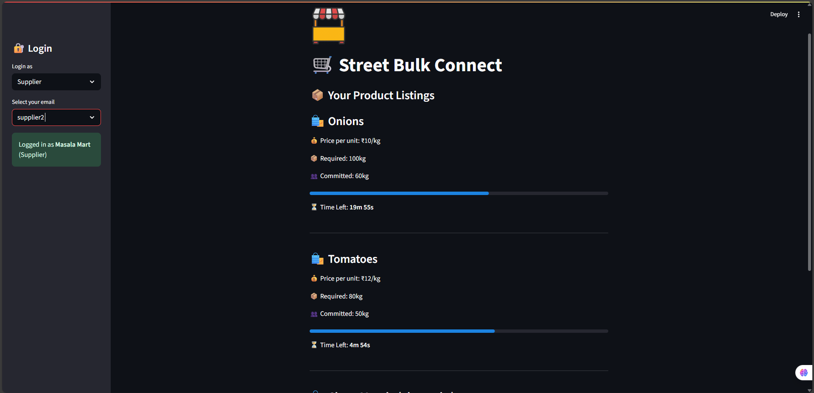

##TEAM NAME: CODE4CAUSE

**TEAM MEMBER1: Mulla Shaista**
**TEAM MEMBER2: SHAIK MAHAMMAD SHAHID AFRID**
**TEAM MEMBER3: Shaik Sheema Firdose**

# 🛒 Street Bulk Connect

**Street Bulk Connect** is a Streamlit-based group-buying app designed for **street vendors and suppliers** to collaborate on bulk orders. Vendors can join ongoing product orders to reduce costs, while suppliers can monitor and manage group commitments in real-time.

---

## 🚀 Features

- 🔐 Role-based login system for vendors and suppliers
- 🧑‍🍳 Vendors can:
  - Browse open group orders
  - Join by committing quantity
  - Track real-time progress
- 📦 Suppliers can:
  - View listed product orders
  - Track order commitments
  - See countdown to order expiry
- ⏳ Real-time timer and progress bar
- 🎨 Custom dark-themed UI with branding

---

## 🖼️ Screenshots

| Vendor View | Supplier View |
|-------------|---------------|
|  |  |

---

## 🧑‍💻 Tech Stack

- Python 3.10+
- [Streamlit]([https://streamlit.io/](https://street-bulk-connect.streamlit.app/)) (UI framework)

---

## 📁 Project Structure

street_bulk/
├── app.py
├── assets/
│ ├── logo.jpg
│ └── styles.css
├── components/
│ ├── login.py
│ ├── supplier_dashboard.py
│ └── vendor_dashboard.py
├── data/
│ └── sample_data.py
├── utils/
│ └── helpers.py
└── requirements.txt


## 🔧 Installation & Run

1. **Clone the repo / extract ZIP**
2. **Install dependencies**:
    ```bash
    pip install -r requirements.txt
    ```
3. **Run the app**:
    ```bash
    streamlit run app.py
    ```

4. Open in browser at: `http://localhost:8501`

---

## 🧪 Sample Users

| Username   | Role     | Display Name         |
|------------|----------|----------------------|
| vendor1    | vendor   | Ravi Chaat           |
| vendor2    | vendor   | Seema Snacks         |
| vendor3    | vendor   | Tikki Tandoor        |
| supplier1  | supplier | FreshVeg Distributors|
| supplier2  | supplier | Masala Mart          |

---

## 📹 Demo Video (Optional)
> Record using tools like OBS or Loom, and show login, role-based views, and interaction.

---

## 📬 Contact / Credits

Made by Mulla Shaista
📧 Email: shaistamulla2909@gmail.com

---

## 📝 License

This project is open source and free to use under the MIT License.
